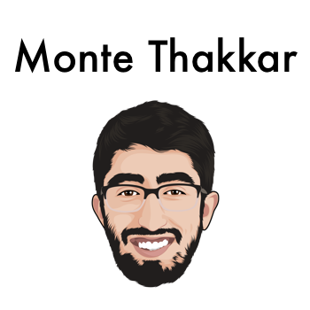

  
  
  
  
  

  
  

 

---

 

Monte is a full-stack engineer that has lived in San Francisco for the past few years. He worked at a short-term rental startup - [Pillow](https://www.pillow.com/) - which got acquired by Expedia in 2018.

He is currently working remotely from Bangalore, India as an iOS engineer for Expedia.

Monte is also working on his own startup, [Kandou](https://www.kandouapp.com/) which aims to help others make a positive impact on their community through volunteering. Kandou provides tools and resources to companies to help organize & manage their CSR (Corporate Social Responsibility) programs easily. Reach out to hello@kandouapp.com for more information.

Portfolio: montethakkar.com

Email: manthan.thakkar@gmail.com

 

## Latest Projects 

- [**Data Rights Are Human Rights**](http://datarightsarehumanrights.com/) - A website to promote online privacy and resources to help users take control of their own personal data on the internet.
- [**San Francisco Ramen Club**](http://sanfranciscoramen.club/) - Best ramen spots in San Francisco tried and rated by Monte. It's a custom Google Map that has over 2,200 views.
- [**Dear Earth**](https://dear.earth/) - A website to raise awareness about climate change. Do something before it's too late!

 

---

## Experience

### Co-founder, [Kandou](https://www.kandouapp.com/)

October 2018 - Present | San Francisco

**Kandou makes social impact simple and social.**

 

### iOS Engineer, [Expedia](https://lifeatexpediagroup.com/)

Jan 2020 - Present | Austin, TX

 

### Full Stack Engineer, [Pillow](https://www.pillow.com/)

Feb 2017 - Dec 2019 (~3 years)  | San Francisco

 

## Education

### Computer Science, [San Francisco State University](https://sfsu.edu/)

2014 - 2016 | San Francisco

 

## Stack

### Programming

- Javascript, React, React Native, Swift, Objective-C

### Platforms

- Firebase, Heroku and AWS

### Design

- Sketch and Preview

### Languages

- English, Hindi, Kannada, Gujarati, Kutchi

 

## Quirks

- I am the moderator of [/r/elonmusk](https://www.reddit.com/r/elonmusk/) - a subreddit dedicated for Elon Musk discussion & updates. I joined the team when it had less than 10k members and it currently has 170k members.
- I am ramen-obsessed. I have probably tried almost every ramen restaurant in San Francisco and maintain a personal ranking of the best ramen spots in SF.